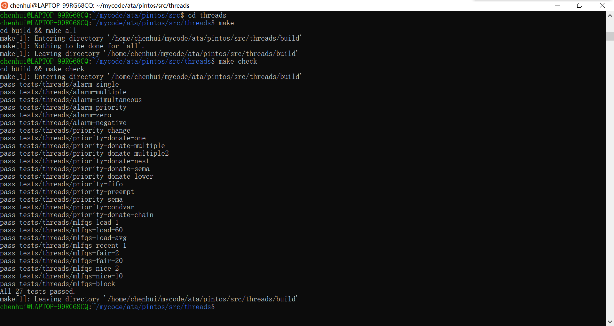

Design Document for Project 2: Threads
======================================

## Group Members

* Chenhui <1017010573@qq.com>


## **Task 1: Efficient Alarm Clock**
&emsp;&emsp;这一部分的任务在于重新实现在"devices/timer.c"中定义的`timer_sleep()`函数。尽管pintos源码提供了一种可行的实现方法，但是系统现在是使用busy wait实现的，即线程不停地循环旋转检查当前时间并调用`thread_yield()`，直到时间片耗尽。需要更改`timer_sleep`的实现方式以避免忙等待。
### **当前系统timer_sleep()函数实现**
`Function: void timer_sleep (int64_t ticks)`
```
/* Sleeps for approximately TICKS timer ticks.  Interrupts must
   be turned on. */
void timer_sleep (int64_t ticks)
{
  int64_t start = timer_ticks ();
  ASSERT (intr_get_level () == INTR_ON);
  while (timer_elapsed (start) < ticks)
    thread_yield();
}
```

&emsp;&emsp;暂停执行调用线程，直到时间提前至少x个计时器滴答为止。除非系统处于空闲状态，否则线程无需在精确的x滴答之后唤醒。他们等待正确的时间后，只需将其放在准备好的队列中即可。`timer_sleep()`对于实时运行的线程很有用，例如每秒闪烁一次光标。`timer_sleep()`的参数以计时器刻度表示，而不是以毫秒或任何其他单位表示。每秒有*TIMER_FREQ*定时器滴答，其中*TIMER_FREQ*是在"devices/timer.h"中定义的宏，默认值为100。

&emsp;&emsp;通过研读源码，对原来的`timer_sleep`的实现方式有了一定的理解，也能够看到它的缺点：线程依然不断在cpu就绪队列和running队列之间来回，占用了cpu资源，这并不是我们想要的，我们希望用一种唤醒机制来实现这个函数。 

### **函数重新实现**
&emsp;&emsp;实现思路：调用`timer_sleep()`时直接将线程阻塞，为线程struct增加一个成员*ticks_blocked*用于记录线程被阻塞的时间，然后利用操作系统自身的时钟中断，在其中加入对线程状态的检测（每个tick会执行一次），每次检测将*ticks_blocked*减1，当减到0时就唤醒这个线程。  
```
/* Sleeps for approximately TICKS timer ticks.  Interrupts must
   be turned on. */
void timer_sleep (int64_t ticks)
{
  if (ticks <= 0)
  {
    return;
  }
  ASSERT (intr_get_level () == INTR_ON);
  enum intr_level old_level = intr_disable ();
  struct thread *current_thread = thread_current ();
  current_thread->ticks_blocked = ticks;
  thread_block ();
  intr_set_level (old_level);
}
```
其中调用的`thread_block ()`
```
/* Puts the current thread to sleep.  It will not be scheduled
   again until awoken by thread_unblock().

   This function must be called with interrupts turned off.  It
   is usually a better idea to use one of the synchronization
   primitives in synch.h. */
void thread_block (void)
{
  ASSERT (!intr_context ());
  ASSERT (intr_get_level () == INTR_OFF);
  thread_current ()->status = THREAD_BLOCKED;
  schedule ();
}
```
为线程的结构体增加*ticks_blocked*成员
```
int64_t ticks_blocked;      /* Record the time the thread has been blocked. */
```
线程创建时将*ticks_blocked*初始化为0，将以下代码加在`thread_create()`函数内：
```
t->ticks_blocked = 0;
```
修改时钟中断处理函数，加入对线程sleep时间的检测，在`timer_interrupt()`函数内增加以下代码：
```
thread_foreach (blocked_thread_check, NULL);
```
其中`thread_foreach(thread_action_func *func, void *aux)`在所有线程中调用函数'func'，传递参数'aux'。这个函数必须在中断关闭的情况下调用。这里对每个线程都执行函数`blocked_thread_check()`：
```
/* Invoke function 'func' on all threads, passing along 'aux'.
   This function must be called with interrupts off. */
void thread_foreach (thread_action_func *func, void *aux)
{
  struct list_elem *e;
  ASSERT (intr_get_level () == INTR_OFF);
  for (e = list_begin (&all_list); e != list_end (&all_list);
       e = list_next (e))
    {
      struct thread *t = list_entry (e, struct thread, allelem);
      func (t, aux);
    }
}
```
另外需要给thread结构体添加一个方法`blocked_thread_check()`用于检查阻塞线程，首先在thread.h中声明：
```
void blocked_thread_check (struct thread *t, void *aux UNUSED);
```
然后在thread.c中实现：
```
/* Check the blocked thread */
void blocked_thread_check (struct thread *t, void *aux UNUSED)
{
  if (t->status == THREAD_BLOCKED && t->ticks_blocked > 0)
  {
      t->ticks_blocked--;
      if (t->ticks_blocked == 0)
      {
          thread_unblock(t);
      }
  }
}
```
其中这里的`thread_unblock()`用于唤醒线程，并将其加入就绪队列：
```
/* Transitions a blocked thread T to the ready-to-run state.
   This is an error if T is not blocked.  (Use thread_yield() to
   make the running thread ready.)

   This function does not preempt the running thread.  This can
   be important: if the caller had disabled interrupts itself,
   it may expect that it can atomically unblock a thread and
   update other data. */
void thread_unblock (struct thread *t)
{
  enum intr_level old_level;
  ASSERT (is_thread (t));
  old_level = intr_disable ();
  ASSERT (t->status == THREAD_BLOCKED);
  list_push_back (&ready_list, &t->elem);
  t->status = THREAD_READY;
  intr_set_level (old_level);
}
```
至此，`timer_sleep()`函数唤醒机制就实现了。
## **Task 2: Priority Scheduler**
### **priority schedule**
&emsp;&emsp;这一部分的任务在于在pintos系统中实现优先级调度。当一个线程加入到具有比当前正在运行的线程更高优先级的就绪队列时，当前线程应立即将处理器移交给新线程，即允许优先级大的线程抢占低优先级的线程。同样，当线程正在等待锁、信号量或条件变量时，应该首先唤醒优先级最高的线程。线程可以随时提高或降低其自身的优先级，但是降低其优先级以使其不再具有最高优先级时，必须立即让出CPU。

&emsp;&emsp;线程优先级的范围是从PRI_MIN(0)到PRI_MAX(63)。较低的数字对应较低的优先级，因此优先级0是最低优先级，优先级63是最高优先级。初始线程优先级作为参数传递给`thread_create()`。如果没有理由选择其他优先级，则使用PRI_DEFAULT(31)。PRI_宏是在"threads/thread.h"中定义的，不应更改其值。

&emsp;&emsp;实现以下函数，这些函数允许线程检查和修改其自身的优先级。这些功能的框架在"threads/thread.c"中提供。
> ```
> Function: void thread_set_priority (int new_priority )
> ```
> 将当前线程的优先级设置为new_priority。 如果当前线程不再具有最高优先级，则让出CPU。
> ```
> Function: int thread_get_priority (void)
> ```
> 返回当前线程的优先级。 在存在优先级捐赠的情况下，返回较高（捐赠的）优先级。
### **函数设计**
&emsp;&emsp;实现优先级调度的核心思想就是维护就绪队列为优先级队列。当一个线程被创建时候，应给出一个优先级，然后如果新的线程的优先级大于当前正在运行的线程，则将运行的线程阻塞加入到就绪队列中。
### **函数实现**
&emsp;&emsp;在以下三种情况下会将一个线程加入到绪队列中：
1. thread_unblock
2. init_thread
3. thread_yield

&emsp;&emsp;那么只要在线程加入到绪队列中时维持这个就绪队列为优先级队列即可。观察系统实现线程唤醒函数`thread_unblock()`，这里将加入就绪队列的线程直接加到队列尾部了，但与优先队列相悖。于是我们需要修改一下线程加入就绪队列的动作，因为调度的时候下一个thread是直接取队头的。

直接将`thread_unblock()`函数中的`list_push_back()`改成：
```
list_insert_ordered (&ready_list, &t->elem, (list_less_func *) &thread_cmp_priority, NULL);
```
即在线程加入到就绪队列时，将其插入到队列中的适当位置，然后实现一下线程优先级比较函数`thread_cmp_priority()`：
```
/* Priority compare function. */
bool thread_cmp_priority (const struct list_elem *a, const struct list_elem *b, void *aux UNUSED)
{
  return list_entry(a, struct thread, elem)->priority > list_entry(b, struct thread, elem)->priority;
}
```
然后对`thread_yield()`和`thread_init()`里的`list_push_back()`作同样的修改。

&emsp;&emsp;抢占式调度，即在创建一个线程的时候，如果线程高于当前线程就先执行创建的线程。所以在设置一个线程优先级要立即重新考虑所有线程执行顺序，重新安排执行顺序。直接在线程设置优先级的时候调用`thread_yield()`即可，这样就把当前线程重新加入到就绪队列中继续执行，保证了执行顺序。此外，在创建线程的时候，如果新创建的线程比主线程优先级高的话也需要调用`thread_yield()`。
```
/* Sets the current thread's priority to NEW_PRIORITY. */
void thread_set_priority (int new_priority)
{
  thread_current ()->priority = new_priority;
  thread_yield ();
}
```
然后在线程创建时`thread_create()`最后把创建的线程*unblock*了之后加上以下代码：
```
/* Add to run queue. */
  thread_unblock (t);
  if (thread_current ()->priority < priority)
  {
     thread_yield ();
  }
```
### **Priority donation**
&emsp;&emsp;优先级调度的一个问题是"优先级倒置"。分别考虑高、中和低优先级线程H，M和L。如果H需要等待L（例如，对于由L持有的锁），而M为在就绪列表中，然后H将永远不会获得CPU，因为低优先级线程不会获得任何CPU时间。解决此问题的部分方法是，当L持有锁时，H将其优先级"捐赠"给L。L释放（因此，H获取）锁。

&emsp;&emsp;实现优先级捐赠。将需要考虑适用于需要优先捐赠的所有不同情况。确保处理多个捐赠，其中将多个优先级捐赠给单个线程。还必须处理嵌套捐赠：如果H正在等待M持有的锁，而M正在等待L持有的锁，则M和L都应提升为H的优先级。

### **函数设计**
&emsp;&emsp;当发现高优先级的任务因为低优先级任务占用资源而阻塞时，就将低优先级任务的优先级提升到等待它所占有的资源的最高优先级任务的优先级。具体实现思路如下：
1.  在一个线程获取一个锁的时候，如果拥有这个锁的线程优先级比自己低就提高它的优先级，并且如果这个锁还被别的锁锁着，将会递归地捐赠优先级，然后在这个线程释放掉这个锁之后恢复未捐赠逻辑下的优先级。
2. 如果一个线程被多个线程捐赠，维持当前优先级为捐赠优先级中的最大值（*acquire*和*release*之时）。
3. 在对一个线程进行优先级设置的时候，如果这个线程处于被捐赠状态，则对*original_priority*进行设置，然后如果设置的优先级大于当前优先级，则改变当前优先级， 否则在捐赠状态取消的时候恢复*original_priority*。
4. 在释放锁对一个锁优先级有改变的时候应考虑其余被捐赠优先级和当前优先级。
5. 将信号量的等待队列实现为优先级队列。
6. 将*condition*的*waiters*队列实现为优先级队列。
7. 释放锁的时候若优先级改变则可以发生抢占。
### **函数实现**
修改结构体*thread*，添加如下的新成员：
```
int base_priority;                  /* Base priority. */
struct list locks;                  /* Locks that the thread is holding. */
struct lock *lock_waiting;          /* The lock that the thread is waiting for. */
```
对*lock*数据结构进行修改
1. 记录当前*lock*得资源是哪个线程所持有得
2. 记录锁得优先级
```
struct list_elem elem;      /* List element for priority donation. */
int max_priority;          /* Max priority among the threads acquiring the lock. */
```
先修改`lock_acquire()`函数，在P操作之前递归地实现优先级捐赠，然后在线程被唤醒之后（此时这个线程已经拥有了这个锁），成为这个锁的拥有者。
```
void lock_acquire (struct lock *lock)
{
  struct thread *current_thread = thread_current ();
  struct lock *l;
  enum intr_level old_level;
  ASSERT (lock != NULL);
  ASSERT (!intr_context ());
  ASSERT (!lock_held_by_current_thread (lock));
  if (lock->holder != NULL && !thread_mlfqs)
  {
    current_thread->lock_waiting = lock;
    l = lock;
    while (l && current_thread->priority > l->max_priority)
    {
      l->max_priority = current_thread->priority;
      thread_donate_priority (l->holder);
      l = l->holder->lock_waiting;
    }
  }
  sema_down (&lock->semaphore);
  old_level = intr_disable ();
  current_thread = thread_current ();
  if (!thread_mlfqs)
  {
    current_thread->lock_waiting = NULL;
    lock->max_priority = current_thread->priority;
    thread_hold_the_lock (lock);
  }
  lock->holder = thread_current ();
  intr_set_level (old_level);
}
```
这里`thread_donate_priority`和`thread_hold_the_lock`封装成函数，注意一下这里优先级捐赠是通过直接修改锁的最高优先级，然后调用update的时候把现成优先级更新实现的，实现如下：
```
/* Let thread hold a lock */
void thread_hold_the_lock(struct lock *lock)
{
  enum intr_level old_level = intr_disable ();
  list_insert_ordered (&thread_current ()->locks, &lock->elem, lock_cmp_priority, NULL);
  if (lock->max_priority > thread_current ()->priority)
  {
    thread_current ()->priority = lock->max_priority;
    thread_yield ();
  }
  intr_set_level (old_level);
}
```
```
/* Donate current priority to thread t. */
void thread_donate_priority (struct thread *t)
{
  enum intr_level old_level = intr_disable ();
  thread_update_priority (t);
  if (t->status == THREAD_READY)
  {
    list_remove (&t->elem);
    list_insert_ordered (&ready_list, &t->elem, thread_cmp_priority, NULL);
  }
  intr_set_level (old_level);
}
```
实现锁队列排序函数`lock_cmp_priority`:
```
bool lock_cmp_priority (const struct list_elem *a, const struct list_elem *b, void *aux UNUSED)
{
  return list_entry (a, struct lock, elem)->max_priority > list_entry (b, struct lock, elem)->max_priority;
}
```
然后在释放锁`lock_release`函数加入以下语句，即当执行thread_mlfqs的时候线程不释放锁：
```
if (!thread_mlfqs)
    thread_remove_lock (lock);
```
`thread_remove_lock`实现如下：
```
/* Remove a lock. */
void thread_remove_lock (struct lock *lock)
{
  enum intr_level old_level = intr_disable ();
  list_remove (&lock->elem);
  thread_update_priority (thread_current ());
  intr_set_level (old_level);
}
```
每释放掉一个锁时，用`thread_update_priority`来处理当前线程的优先级可能发生的变化，如果这个线程还有锁， 就先获取该线程拥有锁的最大优先级（可能被更高级线程捐赠），然后如果这个优先级比*base_priority*大的话更新的应该是被捐赠的优先级。线程更新优先级函数：判断线程持有的锁，并且更新线程的优先级。
```
/* Update priority. */
void thread_update_priority (struct thread *t)
{
  enum intr_level old_level = intr_disable ();
  int max_priority = t->base_priority;
  int lock_priority;
  if (!list_empty (&t->locks))
  {
    list_sort (&t->locks, lock_cmp_priority, NULL);
    lock_priority = list_entry (list_front (&t->locks), struct lock, elem)->max_priority;
    if (lock_priority > max_priority)
      max_priority = lock_priority;
  }
  t->priority = max_priority;
  intr_set_level (old_level);
}
```
在`init_thread`中加入初始化：
```
t->base_priority = priority;
list_init (&t->locks);
t->lock_waiting = NULL;
```
修改设置优先级函数`thread_set_priority`：
```
void thread_set_priority (int new_priority)
{
  if (thread_mlfqs)
    return;
  enum intr_level old_level = intr_disable ();
  struct thread *current_thread = thread_current ();
  int old_priority = current_thread->priority;
  current_thread->base_priority = new_priority;
  if (list_empty (&current_thread->locks) || new_priority > old_priority)
  {
    current_thread->priority = new_priority;
    thread_yield ();
  }
  intr_set_level (old_level);
}
```
将*condition*的队列改成优先级队列，修改如下，修改`cond_signal`函数：
```
void cond_signal (struct condition *cond, struct lock *lock UNUSED)
{
  ASSERT (cond != NULL);
  ASSERT (lock != NULL);
  ASSERT (!intr_context ());
  ASSERT (lock_held_by_current_thread (lock));
  if (!list_empty (&cond->waiters))
  {
    list_sort (&cond->waiters, cond_sema_cmp_priority, NULL);
    sema_up (&list_entry (list_pop_front (&cond->waiters), struct semaphore_elem, elem)->semaphore);
  }
}
```
实现信号量比较函数`cond_sema_cmp_priority`：
```
/* cond sema comparation function */
bool cond_sema_cmp_priority (const struct list_elem *a, const struct list_elem *b, void *aux UNUSED)
{
  struct semaphore_elem *sa = list_entry (a, struct semaphore_elem, elem);
  struct semaphore_elem *sb = list_entry (b, struct semaphore_elem, elem);
  return list_entry(list_front(&sa->semaphore.waiters), struct thread, elem)->priority > list_entry(list_front(&sb->semaphore.waiters), struct thread, elem)->priority;
}
```
最后将信号量的等待队列实现为优先级队列，修改V操作`sema_up`：
```
void sema_up (struct semaphore *sema)
{
  enum intr_level old_level;
  ASSERT (sema != NULL);
  old_level = intr_disable ();
  if (!list_empty (&sema->waiters))
  {
    list_sort (&sema->waiters, thread_cmp_priority, NULL);
    thread_unblock (list_entry (list_pop_front (&sema->waiters), struct thread, elem));
  }
  sema->value++;
  thread_yield ();
  intr_set_level (old_level);
}
```
修改P操作`sema_down`：
```
void sema_down (struct semaphore *sema)
{
  enum intr_level old_level;
  ASSERT (sema != NULL);
  ASSERT (!intr_context ());
  old_level = intr_disable ();
  while (sema->value == 0)
    {
      list_insert_ordered (&sema->waiters, &thread_current ()->elem, thread_cmp_priority, NULL);
      thread_block ();
    }
  sema->value--;
  intr_set_level (old_level);
}
```
## **Task 3: Multi-Level Feedback Queue cheduler (MLFQS)**
&emsp;&emsp;实现类似于BSD调度程序的多级反馈队列调度程序，以减少在系统上运行作业的平均响应时间。与优先级调度程序类似，高级调度程序根据优先级选择要运行的线程。但是，高级调度程序不会进行优先级捐赠。因此建议在开始使用高级调度程序之前，先进行优先级调度程序的工作，但可能需要优先级捐赠。

&emsp;&emsp;在启用BSD调度程序之后，线程不再直接控制自己的优先级。应该忽略对`thread_create()`的优先级参数以及对`thread_set_priority()`的任何调用，而对`thread_get_priority()`的调用应返回调度程序设置的线程的当前优先级。在以后的任何项目中都不会使用高级调度程序。

&emsp;&emsp;通用调度程序的目标是平衡线程的不同调度需求。那些执行大量I/O操作的线程需要快速的响应时间，以保持输入和输出设备繁忙，但只需很少的CPU时间。另一方面，计算密集的线程需要接收大量CPU时间完成计算，但无需快速的响应时间。其他线程介于两者之间，I/O周期和计算周期交替执行，因此随着时间变化会有不同需求。设计良好的调度程序通常可以接纳所有不同要求类型的线程。

&emsp;&emsp;这种类型的调度程序维护着几个准备运行的线程队列，其中每个队列包含具有不同优先级的线程。在任何给定时间，调度程序都会从优先级最高的非空队列中选择一个线程。如果最高优先级队列包含多个线程，则它们以"轮转(round robin)"顺序运行。调度程序有几处要求在一定数量的计时器滴答之后更新数据。在每种情况下，这些更新应在任何普通内核线程有机会运行之前进行，这样内核线程就不可能看到新增加的"timer_ticks()"值，只能看到旧的调度程序数据值。

### **Calculating Priority**
&emsp;&emsp;调度程序具有64个优先级，因此有64个就绪队列，编号为0（PRI_MIN）到63（PRI_MAX）。较低的数字对应较低的优先级，因此优先级0是最低优先级，优先级63是最高优先级。线程优先级最初是在线程初始化时计算的。每个线程的第四个时钟滴答也会重新计算一次。无论哪种情况，均由以下公式确定
```
priority = PRI_MAX - (recent_cpu / 4) - (nice * 2)
```
其中recent_cpu是线程最近使用的CPU时间的估计值，而nice是线程的nice值。结果应四舍五入到最接近的整数（舍去）。已经发现在recent_cpu和nice上分别为1/4和2的系数在实践中效果很好，但缺乏更深层的含义。计算得到的priority将始终调整为处于PRI_MIN至PRI_MAX的范围内。该公式为最近接收到CPU时间的线程赋予较低的优先级，以便在下次调度程序运行时重新分配CPU。这是防止饥饿的关键：最近未接收任何CPU时间的线程的recent_cpu为0，除非高nice值，否则它很快会收到CPU时间。

### **Calculating recent_cpu**
&emsp;&emsp;recent_cpu是测量每个进程"最近"获得了多少CPU时间。此外，作为改进，距离现在更近的CPU时间应比相对较旧的CPU时间拥有更大的权重。recent_cpu的初始值在创建的第一个线程中为0，在其他新线程中为父级的值。每次发生计时器中断时，除非正在运行的空闲线程，否则recent_cpu仅对正在运行的线程加1。另外，每秒使用以下公式重新计算每个线程（运行，就绪还是阻塞）的recent_cpu的值：
```
recent_cpu = (2*load_avg)/(2*load_avg + 1) * recent_cpu + nice
```
其中load_avg是准备运行的线程数的移动平均值。如果load_avg为1，表示平均一个线程正在争夺CPU，则 recent_cpu的当前值衰减为权重。 1 in ln（.1）/ln（2/3）= 约6秒；如果load_avg为2，则衰减到.1的权重大约需要ln（.1）/ ln（3/4）= 约8秒。结果是recent_cpu估计线程"最近"接收到的CPU时间，衰减率与争用CPU的线程数成反比。

&emsp;&emsp;最后，load_avg（通常称为系统平均负载）估计过去一分钟准备运行的平均线程数。与recent_cpu一样，它是指数加权的移动平均值。与priority和recent_cpu不同，load_avg是系统级的，而不是特定于线程的。在系统引导时，它将初始化为0。此后每秒一次，将根据以下公式进行更新：
```
load_avg = (59/60)*load_avg + (1/60)*ready_threads
```

&emsp;&emsp;总而言之，系统维持了64个队列，每个队列对应一个优先级，从PRI_MIN到PRI_MAX。然后通过一些公式计算来计算出线程当前的优先级，系统调度的时候会从高优先级队列开始选择线程执行，这里线程的优先级随着操作系统的运转数据而动态改变。这个计算又涉及到了浮点数运算的问题：

|   |	  | 
| :----: | :----: |
| Convert n to fixed point: |	n * f | 
| Convert x to integer (rounding toward zero): |	x / f |
| Convert x to integer (rounding to nearest):	 | (x + f / 2) / f if x >= 0,(x - f / 2) / f if x <= 0 |
| Add x and y: | 	x + y |
| Subtract y from x: |	x - y |
| Add x and n: |	x + n * f |
| Subtract n from x: |	x - n * f |
| Multiply x by y: |	((int64_t) x) * y / f |
| Multiply x by n: |	x * n |
| Divide x by y: |	((int64_t) x) * f / y |
| Divide x by n: |	x / n |

&emsp;&emsp;实现思路：在`timer_interrupt`中固定一段时间计算更新线程的优先级，这里是每*TIMER_FREQ*时间更新一次系统*load_avg*和所有线程的*recent_cpu*，每4个*timer_ticks*更新一次线程优先级，每个*timer_tick* running线程的*recent_cpu*加一，虽然这里说的是维持64个优先级队列调度，其本质还是优先级调度，保留之前写的优先级调度代码即可，去掉优先级捐赠（之前donate相关代码已经对需要的地方加了thread_mlfqs的判断了）。浮点运算逻辑实现在fixed_point.h中：
```
#ifndef __THREAD_FIXED_POINT_H
#define __THREAD_FIXED_POINT_H

/* Basic definitions of fixed point. */
typedef int fixed_t;
/* 16 LSB used for fractional part. */
#define FP_SHIFT_AMOUNT 16
/* Convert a value to fixed-point value. */
#define FP_CONST(A) ((fixed_t)(A << FP_SHIFT_AMOUNT))
/* Add two fixed-point value. */
#define FP_ADD(A,B) (A + B)
/* Add a fixed-point value A and an int value B. */
#define FP_ADD_MIX(A,B) (A + (B << FP_SHIFT_AMOUNT))
/* Substract two fixed-point value. */
#define FP_SUB(A,B) (A - B)
/* Substract an int value B from a fixed-point value A */
#define FP_SUB_MIX(A,B) (A - (B << FP_SHIFT_AMOUNT))
/* Multiply a fixed-point value A by an int value B. */
#define FP_MULT_MIX(A,B) (A * B)
/* Divide a fixed-point value A by an int value B. */
#define FP_DIV_MIX(A,B) (A / B)
/* Multiply two fixed-point value. */
#define FP_MULT(A,B) ((fixed_t)(((int64_t) A) * B >> FP_SHIFT_AMOUNT))
/* Divide two fixed-point value. */
#define FP_DIV(A,B) ((fixed_t)((((int64_t) A) << FP_SHIFT_AMOUNT) / B))
/* Get integer part of a fixed-point value. */
#define FP_INT_PART(A) (A >> FP_SHIFT_AMOUNT)
/* Get rounded integer of a fixed-point value. */
#define FP_ROUND(A) (A >= 0 ? ((A + (1 << (FP_SHIFT_AMOUNT - 1))) >> FP_SHIFT_AMOUNT) \
        : ((A - (1 << (FP_SHIFT_AMOUNT - 1))) >> FP_SHIFT_AMOUNT))

#endif /* thread/fixed_point.h */
```
修改时钟中断函数`timer_interrupt`的逻辑，加入以下代码： 
```
if (thread_mlfqs)
  {
    thread_mlfqs_increase_recent_cpu_by_one ();
    if (ticks % TIMER_FREQ == 0)
      thread_mlfqs_update_load_avg_and_recent_cpu ();
    else if (ticks % 4 == 0)
      thread_mlfqs_update_priority (thread_current ());
  }
```
1. 实现函数`thread_mlfqs_increase_recent_cpu_by_one ()`
```
/* Increase recent_cpu by 1. */
void thread_mlfqs_increase_recent_cpu_by_one (void)
{
  ASSERT (thread_mlfqs);
  ASSERT (intr_context ());

  struct thread *current_thread = thread_current ();
  if (current_thread == idle_thread)
    return;
  current_thread->recent_cpu = FP_ADD_MIX (current_thread->recent_cpu, 1);
}
```
2. 实现函数`thread_mlfqs_update_load_avg_and_recent_cpu ()`
```
/* Every per second to refresh load_avg and recent_cpu of all threads. */
void thread_mlfqs_update_load_avg_and_recent_cpu (void)
{
  ASSERT (thread_mlfqs);
  ASSERT (intr_context ());

  size_t ready_threads = list_size (&ready_list);
  if (thread_current () != idle_thread)
    ready_threads++;
  load_avg = FP_ADD (FP_DIV_MIX (FP_MULT_MIX (load_avg, 59), 60), FP_DIV_MIX (FP_CONST (ready_threads), 60));

  struct thread *t;
  struct list_elem *e = list_begin (&all_list);
  for (; e != list_end (&all_list); e = list_next (e))
  {
    t = list_entry(e, struct thread, allelem);
    if (t != idle_thread)
    {
      t->recent_cpu = FP_ADD_MIX (FP_MULT (FP_DIV (FP_MULT_MIX (load_avg, 2), FP_ADD_MIX (FP_MULT_MIX (load_avg, 2), 1)), t->recent_cpu), t->nice);
      thread_mlfqs_update_priority (t);
    }
  }
}
```
3. 实现函数`thread_mlfqs_update_priority ()`
```
/* Update priority. */
void thread_mlfqs_update_priority (struct thread *t)
{
  if (t == idle_thread)
    return;

  ASSERT (thread_mlfqs);
  ASSERT (t != idle_thread);

  t->priority = FP_INT_PART (FP_SUB_MIX (FP_SUB (FP_CONST (PRI_MAX), FP_DIV_MIX (t->recent_cpu, 4)), 2 * t->nice));
  t->priority = t->priority < PRI_MIN ? PRI_MIN : t->priority;
  t->priority = t->priority > PRI_MAX ? PRI_MAX : t->priority;
}
```
完成主体逻辑之后，修改thread结构体，增加以下成员：
```
int nice;   /* Niceness. */
fixed_t recent_cpu;   /* Recent CPU. */
```
线程初始化的时候需要初始化这两个新的成员，在`init_thread`中加入这些代码：
```
t->nice = 0;
t->recent_cpu = FP_CONST (0);
```
将一些系统未完成的函数进行实现：
```
/* Sets the current thread's nice value to NICE. */
void thread_set_nice (int nice)
{
  thread_current ()->nice = nice;
  thread_mlfqs_update_priority (thread_current ());
  thread_yield ();
}
```
```
/* Returns the current thread's nice value. */
int thread_get_nice (void)
{
  return thread_current ()->nice;
}
```
```
/* Returns 100 times the system load average. */
int thread_get_load_avg (void)
{
  return FP_ROUND (FP_MULT_MIX (load_avg, 100));
}
```
```
/* Returns 100 times the current thread's recent_cpu value. */
int thread_get_recent_cpu (void)
{
  return FP_ROUND (FP_MULT_MIX (thread_current ()->recent_cpu, 100));
}
```
然后在thread.c中加入全局变量*load_avg*：
```
fixed_t load_avg;
```
并在`thread_start`中初始化:
```
load_avg = FP_CONST (0);
```
&emsp;&emsp;以上整个Threads project就完成了。
