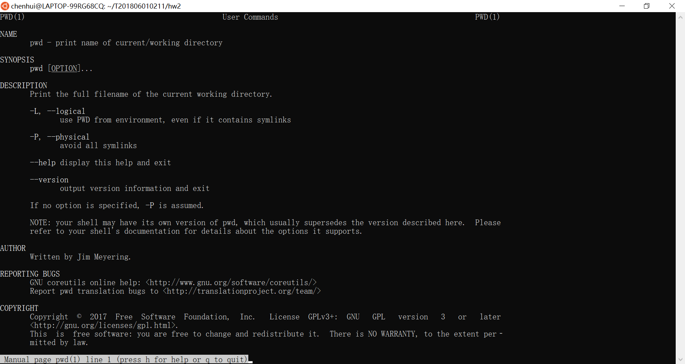
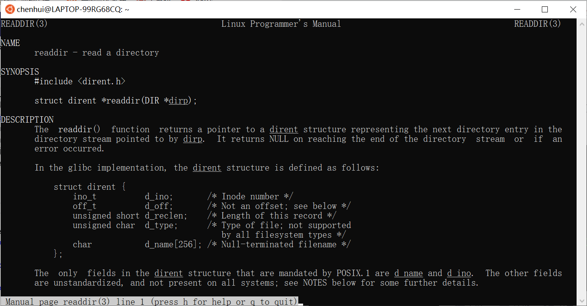
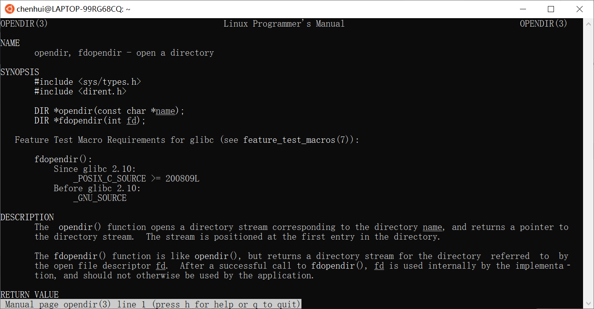
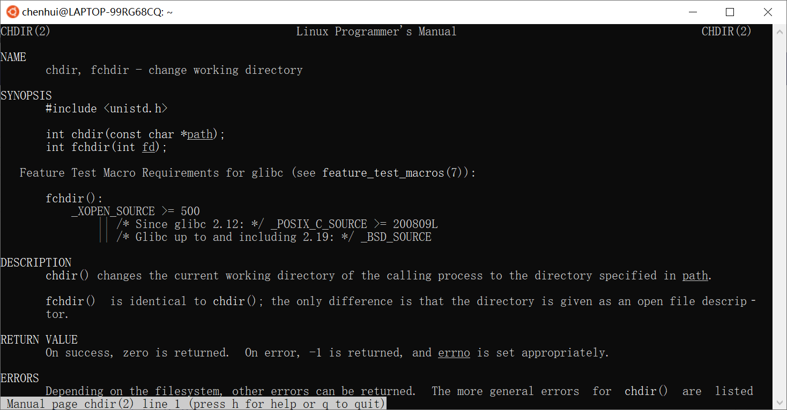
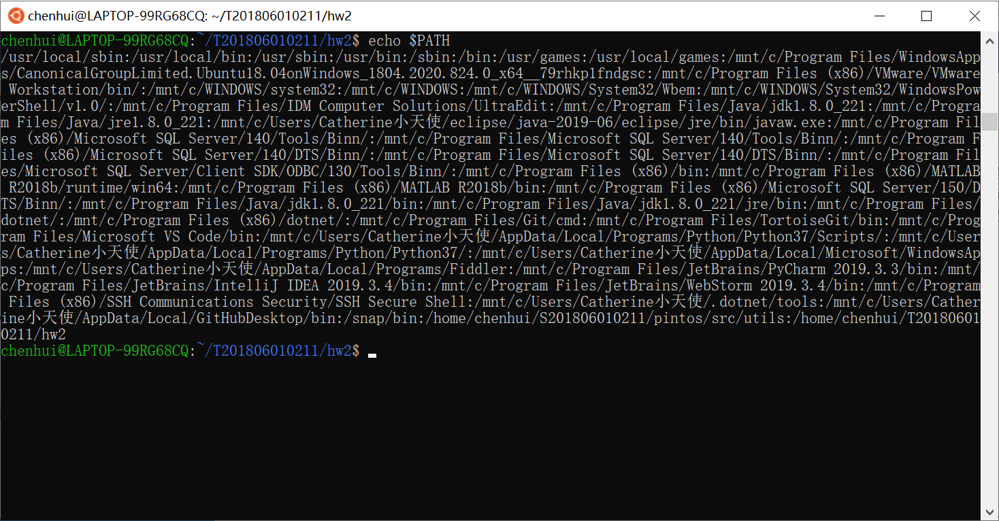

## **1 Add support for cd and pwd**
### **C语言实现linux下pwd命令的两种方法**
#### **学习pwd命令**
* 通过`man pwd`命令查看

* pwd [OPTION]，一般不加参数
    * -P显示当前目录的物理路径
    * -L显示当前目录的连接路径
* 该命令用来显示目前所在的工作目录。指令英文原义：*print work directory*
#### **系统调用**
* 使用`man -k dir | grep 2`命令查看有哪些跟pwd相关的系统调用

* 其中有两个系统调用可能可以用到pwd中
    * `getcwd()`
        * 功能：获取当前工作目录 *get current working directory*
        * 参数
            * char *buf：存储当前路径的字符串
            * size_t size：buf的空间大小
        * 返回值： 成功则返回指向当前路径字符串的指针，错误则返回NULL
    * `readdir()`
    
        * 功能：readdir()返回参数dir目录流的下个目录进入点
        * 参数：DIR * dir。结构dirent定义如下：
```
 struct dirent{ 
    ino_t d_ino;//此目录进入点的
    inode off_t d_off;//目录文件开头至此目录进入点的位移 
    unsigned short int d_reclen;//记录的长度 
    unsigned char d_type;//文件类型 
    char d_name[256]; 
};
```
        * 返回值：成功则返回下个目录进入点。有错误发生或读取到目录文件尾则返回NULL
* 但是`readdir()`不能单独使用，还需要另外的系统调用
    * `opendir()`
     
        * 功能：`opendir()`用来打开参数name指定的目录，并返回DIR\*形态的目录流，和open()类似，接下来对目录的读取和搜索都要使用此返回值 *open a directory*
        * 参数：路径名
        * 返回值：成功则返回DIR* 型态的目录流，打开失败则返回NULL。
    * `chdir()`
    
        * 功能：切换当前目录 *change working directory*
        * 参数：路径名
#### **代码段**
* 使用getcwd()
```
int shell_pwd1()
{
  char path[MAXPATH];
  puts(getcwd(path, MAXPATH));
  return 0;
}
```
### **C语言实现linux下cd命令**
* 使用chdir()
```
chdir(char *path)
```
## **2 Program execution**
### **shell 执行程序**
#### **什么是进程**
&emsp;&emsp;Linux是如何运行程序的？这看起来很容易：首先登录，然后Shell打印提示符，输入命令并按回车键，程序立即就开始运行了。当程序结束后，Shell打印一个新的提示符。但这些是如何实现的呢？Shell做了些什么？内核又做了些什么？程序是什么？运行一个程序意味着什么？

&emsp;&emsp;一个程序是存储在文件中的机器指令序列。运行一个程序意味着将这个机器指令序列载入内存然后让处理器逐条执行这些指令。在Linux术语中，一个可执行程序是一个机器指令及其数据的序列。一个进程是程序运行时的内存空间和设置，它由进程控制块、程序段和数据段三部分组成。简单的说，进程就是运行中的程序。

&emsp;&emsp;可以使用`ps`命令查看用户空间的内容，这个命令会列出当前的进程。这里有两个进程在运行：bash(Shell)和ps命令。每个进程都有一个可以唯一标识它的数字，称为进程ID。一般简称PID。ps有很多选项，和ls命令一样，ps支持-a、-l选项。-a选项列出所有进程，但是不包括Shell；-l选项用来打印更多细节。
#### **Shell是如何运行程序的**
&emsp;&emsp;Shell打印提示符，用户输入命令，Shell就执行这个命令，然后Shell再次打印提示符——如此反复。那么Shell到底是怎么运行程序的呢？一个Shell的主循环执行下面的4步：
1. 接受命令
2. 建立一个新的进程来运行这个命令
3. 将程序从磁盘载入
4. 程序在它的进程中运行直到结束  

&emsp;&emsp;Shell从用户那读入字符串ls。Shell建立一个新的进程，接着在新进程中运行ls程序并等待新进程结束。然后Shell读入新的一行输入，建立一个新进程，在这个进程中运行程序并等待这个进程结束。由此可以看出，要实现这个流程，就需要解决三个问题：如何建立新进程，父进程如何等待子进程结束以及如何在一个程序中运行另一个程序。
#### **如何建立新进程**
&emsp;&emsp;可以使用`fork()`系统调用来创建进程。由fork创建的新进程被称为子进程。fork成功调用后，就会存在两个进程，一个是父进程，另一个是子进程。子进程是新进程，是父进程的副本，简单的说父进程有的东西子进程也都复制了一份。

&emsp;&emsp;内核通过复制父进程来创建子进程，它将父进程的代码和当前运行到的位置都复制给子进程。其中当前运行的位置是由随着代码向下移动的箭头表示的。子进程从fork返回的地方开始运行。fork返回后，父子进程有相同的代码，运行到同一行有相同的数据和进程属性。这时通过fork的返回值来分辨父子进程。不同的进程，fork的返回值是不同的。在子进程中fork返回0，在父进程中fork返回子进程的pid。
#### **父进程如何等待子进程结束**
&emsp;&emsp;进程调用wait可以等待子进程结束，使用方法是：pid = wait(&status);这里系统调用wait做两件事。首先，wait暂停调用它的进程直到子进程结束。然后，wait取得子进程结束时exit的值。

&emsp;&emsp;当子进程调用exit，内核唤醒父进程同时将传递exit的参数。从exit的括号到父进程的箭头表示唤醒和传递exit值的动作。这样wait执行两个操作：通知和通信。通知就是告诉父进程子进程已经结束了，wait的返回值是调用exit的子进程的PID，因此父进程总是可以找到是哪个子进程终止了。通信就是告诉父进程子进程是以何种方式结束的，终止进程的终止状态通过wait的参数返回。wait系统调用的参数status是一个整形指针，如果status不是一个空指针，则终止进程的终止状态就存放在它所指向的单元内。一个进程有3种结束方式：
1. 顺利完成它的任务。在Linux中，成功的程序调用exit(0)或者从main函数中return 0。
2. 进程失败。程序遇到问题而要调用exit退出时，程序需要传给exit一个非零的值。这个值由程序员分配。
3. 程序被一个信号杀死。通常情况下，一个既没有被忽略又没有被捕获的信号会杀死进程。
#### **如何在一个程序中运行另一个程序**
&emsp;&emsp;在Linux系统中一个函数族可以解决这个问题——`exec`函数族(下面简称exec)。exec一共包含六个成员函数，每个函数都通过系统调用`execve`来调用内核服务。当进程调用exec执行一个程序时， exec系统调用从当前进程中把当前程序的机器指令清除，然后在空的进程中载入调用时指定的程序代码，最后运行这个新的程序。也就说exec就像换脑，原来的进程被将要执行的程序替换。下面是这个函数族的一些成员简介：
- int execl(char *pathname, char *arg0,...,argn,(char*)0)
- int execv(char *pathname, char *argv[])
- int execle(char *pathname, char *arg0,...,argn,(char*)0,envp)
- int execve(char *pathname, char *argv,char *const envp[])
- int execvp(char *filename, char *argv[])
- int excelp(char *filename, char *arg0,…,argn,(char*)0)  

&emsp;&emsp;这里主要使用的是`execvp`函数，execvp有两个参数：要运行的程序名和那个程序的命令行参数数组。当程序运行时命令行参数以argv[]传给程序。注意：将数组的第一个元素置为程序的名称，最后一个元素必须是null。

&emsp;&emsp;`execlp`不像execvp那样用一个参数数组。execlp和execvp中的p代表路径(path)，这两个函数在环境变量PATH中列出的路径中查找由第一个参数指定的程序。除了不在PATH中查找程序文件外，execv和execvp非常相似。这6个exec函数的参数很难记忆，可以根据函数名中的字符来记忆。字母p表示该函数取filename作为参数，并且用PATH环境变量寻找可执行文件。字母l表示该函数取一个参数表，v表示该函数取一个argv[]数组。最后，字母e表示该函数取envp[]数组，而不是当前环境。
#### **相关函数调用**
```
execv(char *pathname, char *argv[])
```
## **3 Path resolution**
&emsp;&emsp;通过自定义路径解析，不需要输入程序的完整路径就能够执行程序。
#### **实现方法**
&emsp;&emsp;访问系统变量PATH，已知每个路径之间是以':'相隔的，将输入命令追加到路径上，调用`execv(char *pathname, char *argv[])`

#### **相关源码**
```
 char *path = getenv("PATH"); //Gets the system variable PATH
 char *res = strtok(path,":");
 while (res != NULL)
 {
      newpath[k++] = res;
      res = strtok(NULL, ":"); //Divide by ':' 
 }
 while (execv(temp,sarg) == -1 && j < k)
 {
      strcpy(temp,newpath[j]);
      j++;
      strcat(temp,"/");
      strcat(temp,arglist[0]);
 }
```
## **4 Input/Output Redirection**
&emsp;&emsp;在运行程序时，有时提供文件输入或将输出定向到文件很有用。语法`[process] > [file]`告诉您的Shell将进程的标准输出重定向到文件。同样，语法`[process] < [file]`”`告诉您的shell将文件的内容提供给进程的标准输入。

&emsp;&emsp;修改shell程序，使其支持将stdin和stdout重定向到文件。不需要支持Shell内置命令的重定向。您不需要支持stderr重定向或附加到文件（例如`[process] >> [file]`）。您可以假设特殊字符<和>周围总是有空格。请注意，"< [file]"或"> [file]"不会作为参数传递给程序。
#### **相关函数调用**
```
FILE *freopen( const char *filename, const char *mode, FILE *stream );
```
&emsp;&emsp;该函数可以在不改变代码原貌的情况下改变输入输出环境，但使用时应当保证流是可靠的。其中：

filename：需要重定向到的文件名或文件路径。

mode：代表文件访问权限的字符串。例如，"r"表示"只读访问"、"w"表示"只写访问"、"a"表示"追加写入"。

stream：需要被重定向的文件流。

返回值：如果成功，则返回该指向该输出流的文件指针，否则返回为NULL。
#### **具体函数实现**
&emsp;&emsp;首先获取命令行中，重定向符后的文件名，即">"和"<"后的参数，然后调用函数`freopen`实现重定向输入输出流。
```
int m=0;
char *sarg[100];
char *cook;
char *in="<";
char *out=">";
while (arglist[m] != NULL)
{
    cook = arglist[m];
    if (strcmp(cook,in) == 0 || strcmp(cook,out) == 0)
    {
       break;
    }
    sarg[m] = cook;
    m++;
}
sarg[m] = NULL;
char *inFile,*outFile;
while (arglist[m] != NULL)
{
    cook = arglist[m];
    if (strcmp(in,cook) == 0)
    {
       inFile = arglist[m+1];
       freopen(inFile,"r",stdin);  //重定向读
       m++;
       continue;
    }else if (strcmp(out,cook) == 0)
    {
       outFile = arglist[m+1];
       freopen(outFile,"w",stdout); //重定向写
       m++;
       break;
    }
    m++;
}
```
